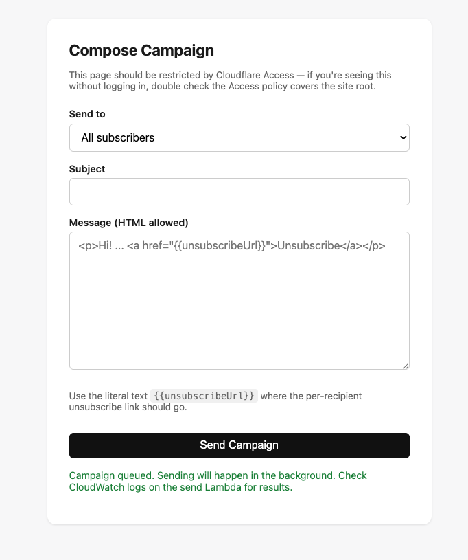

# Bulk Email Tool

A serverless tool for sending bulk email campaigns to a self-managed
subscriber list, with named groups and working unsubscribe support — built
to get around Gmail's sending limits for a small business (originally: a
tennis coach's client list), and to show a real AWS + TypeScript infra
project for job applications.

**There is no public signup page.** Recipients are loaded from a CSV or
Excel file you already have, via an import script — they never visit any
part of this tool except the unsubscribe link in an email they received.

## The compose UI

The admin-only compose page (a Vite + vanilla-TS static site on Cloudflare
Pages, gated behind Cloudflare Access) — pick a list, write an HTML message
with a `{{unsubscribeUrl}}` placeholder, and send:



## Architecture

```
frontend/  Vite + TS static site → Cloudflare Pages
             index.html        compose/send tool (gate with Cloudflare Access)
             unsubscribe.html  unsubscribe confirmation (must stay public)
infra/     AWS CDK (TypeScript) — defines everything below
lambdas/   Three Lambda handlers (TypeScript)
scripts/   CSV/Excel → DynamoDB import script (run locally, not deployed)
shared/    Types + AVAILABLE_LISTS shared between lambdas/frontend/scripts
```

- **DynamoDB** — one table, `email` as partition key, storing `subscribed`,
  `unsubscribeToken`, `createdAt`, and `lists` (which named groups a
  subscriber belongs to).
- **`npm run import-subscribers`** — reads a CSV or Excel file and loads
  rows into DynamoDB. This is how subscribers get in — there's no API
  route for it. Safe to re-run with an updated file (see script header
  comment for exactly how it handles existing/unsubscribed people).
- **GET /unsubscribe** (Lambda + API Gateway) — public. Validates the
  token against DynamoDB and flips `subscribed` to false.
- **POST /campaigns** (Lambda + API Gateway, admin-only) — called by the
  compose page. Checks a shared secret (`x-admin-key` header), then
  asynchronously invokes the send Lambda and returns immediately. Needed
  because API Gateway HTTP APIs hard-cap requests at 29 seconds, and a
  1,500-recipient send takes longer than that.
- **Send campaign** (Lambda, invoked async by `/campaigns` or directly via
  `aws lambda invoke`) — scans subscribers (optionally filtered to one
  named group), sends via SES, embeds each recipient's personal
  unsubscribe link.
- **SES** — handles actual delivery; DKIM/SPF configured via
  `ses.EmailIdentity` in the CDK stack.

## Mailing lists / groups

Defined in `shared/src/types.ts` as `AVAILABLE_LISTS` — edit that array to
match your actual groups (e.g. `["juniors", "adults", "private-lessons"]`).
It drives the dropdown on the compose page. The import script will still
import list names not in this array, but flags them since they won't show
up as a dedicated dropdown option.

## Cost

At ~1,500 recipients/month this runs close to free: SES gives 3,000 free
message charges/month for your first 12 months (then $0.10/1,000 after),
and Lambda / DynamoDB / API Gateway all comfortably fit inside AWS's free
tier at this volume.

## Setup

### 1. AWS account + SES

1. Create an AWS account (or use an existing personal one).
2. Run `aws configure` locally with an IAM user that has permissions for
   CDK deploys (or use AWS SSO).
3. You'll need a domain you control to verify in SES — a subdomain (e.g.
   `updates.friendsdomain.com`) is recommended over the bare root domain,
   to isolate sending reputation from anything else the domain already
   does. After first deploy, check the SES console for the DKIM CNAME
   records CDK generated and add them at your DNS provider.
4. New SES accounts start in the **sandbox** (can only send to verified
   addresses). Request production access from the SES console — usually
   approved within a day — before sending real campaigns.

### 2. Generate the admin secret

This gates the `/campaigns` endpoint — anyone with it can trigger a send,
so treat it like a password:

```bash
openssl rand -hex 32
```

Save the output; you'll pass it to both the CDK deploy and the frontend env vars.

### 3. Install and deploy infra

```bash
npm install
npx cdk bootstrap   # one-time, per AWS account/region
npm run deploy -- \
  -c fromEmail=news@updates.friendsdomain.com \
  -c sendingDomain=updates.friendsdomain.com \
  -c allowedOrigin=https://your-project.pages.dev \
  -c unsubscribeBaseUrl=https://your-project.pages.dev/unsubscribe.html \
  -c adminApiSecret=<output from step 2>
```

Note the `ApiUrl` and `SubscribersTableName` outputs — you'll need both
next. You won't know the real `allowedOrigin` / `unsubscribeBaseUrl` until
after step 5 creates the Cloudflare Pages URL — deploy once with a
placeholder, then redeploy with the real values (see 5c).

### 4. Import the subscriber list

```bash
npm run import-subscribers -- --file ./subscribers.csv --table <SubscribersTableName from step 3>
```

Your file needs a header row with an `email` column. An optional `lists`
column (comma or semicolon separated, e.g. `juniors;private-lessons`)
assigns group membership per row; rows without it fall back to `--list`
(default `general`). Works with `.csv`, `.xlsx`, or `.xls` — just point
`--file` at whichever you have.

Re-run any time your friend sends an updated file — it only adds new
people and merges group membership for existing ones, and never
re-subscribes someone who previously unsubscribed.

### 5. Frontend (Cloudflare Pages)

Local dev first:
```bash
cd frontend
cp .env.example .env   # set VITE_API_URL and VITE_ADMIN_KEY
npm run dev
```

Then connect the repo in Cloudflare:

1. [dash.cloudflare.com](https://dash.cloudflare.com) → **Workers & Pages** → **Create** → **Pages** → **Connect to Git** → select this repo.
2. Build settings:
   - Framework preset: `None`
   - Root directory: *(leave blank — repo root, needed for npm workspaces)*
   - Build command: `npm run build:frontend`
   - Build output directory: `frontend/dist`
3. Environment variables → add `VITE_API_URL` (the `ApiUrl` output) and
   `VITE_ADMIN_KEY` (the same value passed as `adminApiSecret` above).
4. Add `NODE_VERSION` = `20` as an environment variable too.
5. Save and deploy. You'll get a `*.pages.dev` URL — optionally add a
   custom domain under the project's **Custom domains** tab.

Every push to `main` auto-rebuilds and redeploys.

### 5b. Restrict the site with Cloudflare Access (free, up to 50 users)

Gate the whole domain **except** `/unsubscribe.html`, which needs to stay
reachable by anyone clicking an unsubscribe link.

1. **Zero Trust** → **Access** → **Applications** → **Add an application** → **Self-hosted**.
2. Application domain: your Pages URL, path `/*` (the whole site).
3. Add a policy — e.g. "Friends & family": Action `Allow`, Include rule `Emails` → your friend's email and yours.
4. Add a **second** application for the unsubscribe path specifically: domain = your Pages URL, path `/unsubscribe.html`. Give it a policy with Action **Bypass** — this excludes just that path from the login requirement. (More specific paths in Access take precedence over the broader `/*` rule.)
5. Save both. Now the compose tool prompts for login; `/unsubscribe.html` stays open to anyone with a valid link.

The `x-admin-key` check on `/campaigns` is a second, independent layer under
Access — see the security note in `lambdas/src/trigger-campaign.ts`.

### 5c. Update CORS and unsubscribe URL to match

Once you know your Cloudflare Pages URL, re-run the deploy from step 3
with the real values:

```bash
npm run deploy -- \
  -c fromEmail=news@updates.friendsdomain.com \
  -c sendingDomain=updates.friendsdomain.com \
  -c allowedOrigin=https://your-project.pages.dev \
  -c unsubscribeBaseUrl=https://your-project.pages.dev/unsubscribe.html \
  -c adminApiSecret=<same value as before>
```

### 6. Sending a campaign

**Via the compose page** (recommended): log in through Cloudflare Access,
pick a group or "All subscribers", write the subject and HTML body, hit
Send. The page queues the campaign and returns immediately — actual
sending happens in the background over the next several minutes. Check
CloudWatch Logs on the send Lambda (`SendCampaignFunction...`) for
progress and any per-recipient failures.

**Via the CLI** (useful for testing):
```bash
aws lambda invoke \
  --function-name <SendCampaignFunctionName from CDK output> \
  --payload '{"subject":"Hello","html":"<p>Hi! <a href=\"{{unsubscribeUrl}}\">Unsubscribe</a></p>","listName":"juniors"}' \
  --cli-binary-format raw-in-base64-out \
  response.json
```

`{{unsubscribeUrl}}` gets replaced per-recipient with their personal,
token-verified unsubscribe link. Omit `listName` (or set it to `"all"`) to
send to every subscribed address.

## Extending this

- Add an EventBridge scheduled rule to trigger `send.ts` on a cadence.
- Add a `sentAt` field and campaign history table if you want to track
  what's been sent, or surface send progress back in the compose UI (the
  current setup is fire-and-forget — check CloudWatch for results).
- File attachments aren't supported yet — SES's `SendEmailCommand` (used in
  `send.ts`) doesn't support them. Adding them means switching to
  `SendRawEmailCommand` with a hand-built MIME message, plus S3 storage for
  the uploaded file.
- A "remove subscriber" or "add one subscriber" tool in the compose UI,
  for one-off changes without re-running the import script.
# bulk-email-tool
